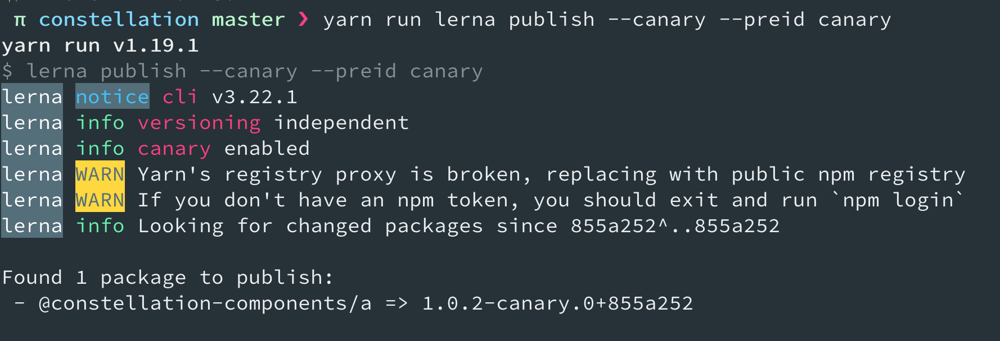

Most product teams in engineering organizations control multiple environments. It's common to have a dev, a staging, and a production environment. Teams use these environments to validate that the code they are shipping to production is high-quality, and to reduce the number of bugs being shipped. If you're a component library maintainer, you can apply this practice to your releases by publishing **canary builds** of your packages that you choose not to share with all/many of your consumers.

Imagine you're a component library maintainer using lerna. (I'm sure you could figure out a way to do this without using lerna, but that's what I'm going to talk about today. If you don't know what lerna is, you can learn more about it in this blog post: [https://maecapozzi.com/what-is-lerna/](/what-is-lerna).).

Let's say that you have a button component called `@my-awesome-library/button@1.0.0`. You are trying to make an additive change to the component's API, so you want to eventually bump the version to `1.1.0`. Before you release it to everyone though, you've asked a few friends to test the new version in their apps.

You're probably already running `lerna publish`, and have some sort of versioning and publishing workflow configured, so we won't touch on that now. But you can create a **canary build** of your package by running the following command `lerna publish --canary --preid canary`.

Lerna will publish a new package for you at at `@my-awesome-library/button@1.0.2-canary.0+855a252`. Now, your friends will be install your canary build, and you didn't even have to release it to the world.

You can get really fancy with this if you tell lerna to allow you to publish from a branch with a certain prefix. Then, you can even auto-publish canary builds from your build step every time someone pushes a PR.

Are you researching monorepos and Lerna for something you're building? What are you stuck on? I'd love to hear from you. You can reach me on [Twitter](https://twitter.com/MCapoz) or by responding to any of my newsletter messages. (Seriously, I really want to hear from you.)

### Hungry for more?

- [What is Lerna?](/what-is-lerna)
- [Before you build a component library: monorepo versioning](/lerna-monorepo-versioning)
- [Should you version components separately or as a unified system?](/version-bundling)
- [4 tools to help you version your component library](/4-tools-to-help-you-version-your-component-library)
- [Before you build a component library: versioning](/library-versioning)
