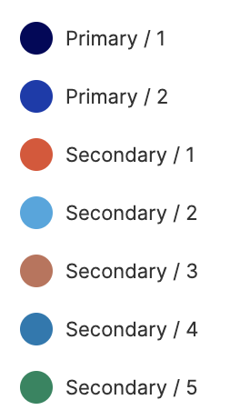

Web developers used to hard-code all of their style data. If a button needed a background color of blue, they'd assign the background color right at the source:

```css
.button {
  background-color: blue;
}
```

That worked for smaller systems that didn't need a theming layer and weren't undergoing frequent redesign. But if you needed a large-scale redesign, this was a painful approach.

Invented by [@jina](https://www.sushiandrobots.com/) for the [Salesforce Lightning Design System](https://www.lightningdesignsystem.com/design-tokens/), design tokens are an approach to storing style attributes like color, typography, and spacing in a pre-determined structure. They are an alternative to directly hard-coding style data that allow designers and developers to build consistent, pleasing layouts, quickly accomplish redesigns, and add a theming layer to their applications.

If a designer uses Figma, their design tokens might be represented like this:



They have specific, generic names. If you changed the value assigned to `primary1`, it still makes sense!

In code, those tokens might look like this:

```ts
const theme = {
  colors: {
    primary1: "#07005B",
    primary2: "#1D35AF",
    secondary1: "#E34F30",
    secondary2: "#3CA6E0",
    secondary3: "#C17259",
    secondary4: "#0E78B2",
    secondary5: "#00875E"
  }
};
```

Those tokens can then be read by whatever styling mechanism we're leveraging. For example, they could be consumed by `styled-components`.

```ts
import styled from "styled-components";
import { Button } from "@harrysforge/button";

const PrimaryButton = styled(Button)`
  background-color: ${props => props.theme.colors.primary1};
`;
```

## Levels of Design Token Usage

I've seen three different levels of design token usage across sites.

**1. No design tokens**

Sites without design tokens have hard-coded style data. There is no central location where style data is stored and managed.

**2. Unstructured design tokens**

In my experience, this is the most common level of design token usage. There is a central location where style data is stored and managed, but the data isn't organized or named in a consistent way.

```ts
const theme = {
  babyBlue: `blue`
};
```

**3. Structured design tokens**

The best-case scenario is when sites have structured design tokens. This is when designers and developers actively agree on a shape and naming conventions for their tokens. It allows designers and developers to communicate more effectively and makes site redesigns and theming much more straightforward.

```ts
const theme = {
  colors: {
    primary1: "#07005B",
    primary2: "#1D35AF",
    secondary1: "#E34F30",
    secondary2: "#3CA6E0",
    secondary3: "#C17259",
    secondary4: "#0E78B2",
    secondary5: "#00875E"
  }
};
```

## Common Workflows

Using design tokens can improve a number of common workflows. There are many cases where having design tokens improve design and developer experience while also providing business value. Let's walk through a couple of these common scenarios, and how they're different for sites that use no design tokens, unstructured design tokens, and structured design tokens.

## 1. Site Redesigns

**No design tokens**

A site’s color palette is primarily blue. If a designer is working in a tool that doesn’t support a shared color library, (like Sketch), if they want they need to update each instance of the color blue in all of their files

It's probably not much better on the code side. A developer will have to look in look through every individual design file that indicates where that color has been changed to orange, and replace the hardcoded blue with orange across the site.

**Unstructured design tokens**

Then, there's the scenario in which design tokens are leveraged, but tokens are named according to the originally-assigned value.

```ts
const theme = {
  colors: {
    babyBlue: "blue"
  }
};
```

In this case, a developer can change `babyBlue` to orange.

```ts
const theme = {
  colors: {
    babyBlue: "orange"
  }
};
```

But now in the codebase, we’re using the token `babyBlue` to represent orange, which is really confusing! So a developer really needs to also change the name of the design token, which kind of defeats the purpose.

**Structured design tokens**

A designer is using a tool that supports shared color libraries like Figma. If they want `primary1` to be orange instead of blue, all they need to do is change the hex code of `primary`, and all of their designs will automatically update with the new color.

In the code, the design tokens look like this:

```ts
const theme = {
  colors: {
    primary1: "blue"
  }
};
```

In this case, all the developer needs to do is change `primary1` to orange and the whole codebase will automatically update in the right places with orange instead of blue.

## 2. Design / Dev Collaboration

Among other benefits, design tokens introduce a common vocabulary that designers and developers can both use when referring to styles, which improves collaboration and reduces back-and-forth, saving time and money.

**No design tokens**

Designers have static mocks that have to be updated by hand everywhere. They might not even know what colors are in the codebase. On the code side, it's hard to audit what colors are part of the site, and whether they match the designs. Everyone resorts to guessing, which causes a lack of UI consistency.

**Unstructured design tokens**

The design tokens are named differently by the designers and the developers. The designers call the blue blue1 while the developers call it babyBlue. It’s hard to communicate about what needs to be changed. Eventually, they figure it out.

**Structured design tokens**

Designers and developers both call the blue `primary1`. Now, when designers want to update a color in their mocks across the whole site, all they need to do is tell a developer to update `primary1` from blue to orange.

## 3. Theming

**No design tokens**

As far as I know, it's not possible.

**Unstructured design tokens**

If your tokens have names like `babyBlue`, it's going to get weird when `babyBlue` is red.

**Structured design tokens**

This will be really straightforward, as long as all of the themes follow the rules of the design tokens.

## 4.Consistent UI Experience

**No design tokens**

Having hard-coded values across the site makes it nearly impossible to maintain consistency. There's no way to constrain the number of styles, and there's no shared language between designers and developers.

**Unstructured design tokens**

This is much better than not having design tokens! At least developers have a good sense of how many different styles they are applying, and an audit is pretty easy.

**Structured design tokens**

This is ideal, since the structure of the design tokens can be shared between developers and designers, and site redesigns will be straightforward and consistent.

## A Shared Design Token Specification

As companies grow, they start to maintain multiple applications at once. A company can begin to address some of the pain points that develop when this starts to happening by agreeing on a shared design token specification.

Agreeing on a shared specification will open a company up to a number of benefits:

- A set of sites with themeable frontends out-of-the-box
- A component library that contains elements that know about the shared specification – which means that you’ll be able to drop a button into your brand and it will be automatically styled according to your design tokens
- Improved collaboration between designers and developers using the shared language of design tokens
- Scripts that can automatically pull data from Figma into your codebase and restyle your frontend

[Brent Jackson](https://jxnblk.com/) is working on an open source shared style specification called [Theme UI](https://theme-ui.com) that aims to solve this problem across companies.
