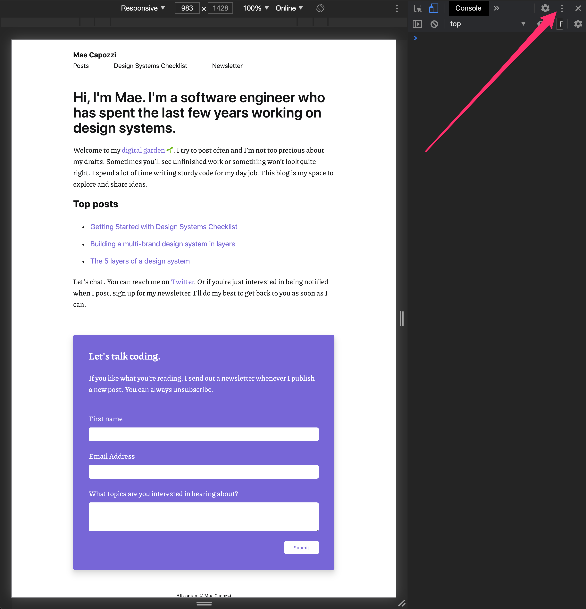

Chrome Dev tools now offers a feature that lets you emulate the following vision deficiencies in dev tools:

- Blurred vision
- Protanopia
- Deuteranopia
- Tritanopia
- Achromatopia

Follow these steps to try it yourself:

1. Open dev tools `cmd+opt+i`
2. Click on the three vertical dots in the top right hand corner of the dev tools.
   
3. Selected More tools > Rendering.
4. Scroll all the way down and select a vision deficiency under "Emulate vision deficiencies."
