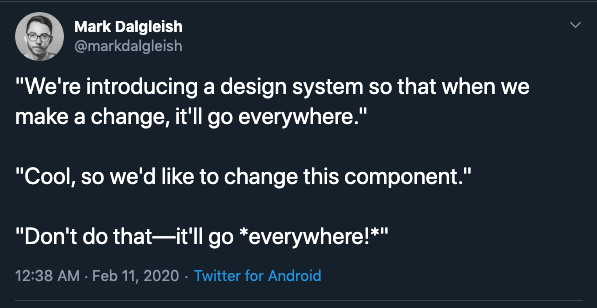

_This post is part of an ongoing series about the problems you'll need to solve before you start building a component library._

- [Before You Build A Component Library: Monorepo or Multirepo?](../monorepo-or-multirepo)
- [Before You Build A Component Library: Versioning](../library-versioning)

I was scrolling through twitter the other day and I saw a joke [tweet](https://twitter.com/markdalgleish/status/1227104671812112385) about design systems:



> "We're introducing a design system so that when we make a change, it'll go everywhere."  
> "Cool, so we'd like to change this component."  
> "Don't do that—it'll go _everywhere!_"

I was thinking about the joke a bit more. I think it taps into a fear that a lot of developers have about design systems and component libraries.I think some of that fear stems from a misunderstanding of how versioning works.

That's when a second tweet popped up that read:

> "We’re going to put it in a monorepo so you can’t even version things!"

It sounds like people have heard incorrect information about monorepos! I was surprised to hear someone say that you can't version packages in a monorepo.

If you're sitting there wondering what a monorepo is, go read this [post](../monorepo-or-multirepo).

Still with me? Great!

## Versioning

When you modify a package, you need to signal to its consumers that you've made changes. You normally do this by incrementing the version number of your package. Most open-source JavaScript and TypeScript libraries use [Semantic Versioning](https://semver.org/) to express the different types of changes a maintainer has made to a package.

I've written about this topic elsewhere, so I'm not going to spend a lot of time reexplaining it. If you'd like to know more, I'd recommend reading [Before You Build A Component Library: Versioning](../library-versioning) before continuing.

## Lerna with Yarn Workspaces

We can use [Lerna](https://github.com/lerna/lerna#lernajson) with [Yarn Workspaces](https://classic.yarnpkg.com/en/docs/workspaces/) to make it possible to develop across multiple components without having to publish them to a registry or rely on `yarn link`.

### Yarn Workspaces

Yarn workspaces allow you to link your packages togethe so that you can use up-to-date code without relying on `yarn link`.

### Lerna

Lerna is a great open-source tool for managing projects with multiple packages. Both [Gatsby](https://github.com/gatsbyjs/gatsby) and [Babel](https://github.com/babel/babel) are open-source monorepos using Lerna behind the scenes.

Lerna provides users with two functionalities -- `lerna bootstrap` and `lerna publish`.

**lerna bootstrap** is a command that allows you to link all of the dependencies in your project together. This means that if you're developing a `<Card />` component that relies on a `<Text />` component, you can easily use modify the `<Text />` component and the `<Card />` component will be able to use the new changes even if you haven't published the new `<Text />` component yet.

**lerna publish** is a command that allows you to publish packages to either the npm registry or your private registry. This command is where versioning comes in! When you increment the version of a package, you can publish that new version, where consumers can download it.

_As an aside, you might feel tempted to write your own scripts to manage your monorepo. I would caution you against this impulse -- you have enough work on your plate trying to set up a component library! You don't need to reinvent the wheel here._

Lerna offers you two versioning schemes for packages in your monorepo: [fixed versioning](https://github.com/lerna/lerna#fixedlocked-mode-default) and [independent versioning](https://github.com/lerna/lerna#independent-mode).

Fixed versioning is the default. It automatically ties all your package versions together, so if you bump one package in the monorepo, all the packages get bumped. Babel is a good example of a monorepo that uses this approach.

The other option is independent versioning. It allows you to increment package versions independently. Gatsby is a good example of a monorepo that uses this approach.

If your monorepo only consists of components and they are often or always used together, fixed versioning should work nicely for your needs. On the other hand, if your monorepo contains unrelated packages, you might prefer independent versioning. You probably don't want to increment the version of your A/B testing tool just because you made changes to the `<Card />` component.

## An Example Case

Imagine that you're working on a project that involves UI components, TypeScript libraries, and starter kits. After doing some research you decide to use a monorepo. You choose a monorepo for a couple of reasons: you want to make sure that it's easy for your teammates to find what they need, you want to easily coordinate changes across modules, and you'd like to maintain a single lint, build, test, and release process.

### 1. Create a new directory

Create a new directory called `monorepo` in your terminal.

```bash
mkdir monorepo
```

### 2. Configure yarn workspaces

Create a **package.json** file and add the following:

```json
{
  "private": true,
  "workspaces": ["packages/*"]
}
```

The workspaces key lets you tell yarn which packages you want to link together. In this case, we want all of the packages under the `/packages` directory to be linked.

We might as well create a directory called `/packages` while we're at it!

### 3. Configure lerna

- Install `lerna` as a `devDependency`

```bash
yarn add lerna -D
```

- Create a **lerna.json** file and add the following:

```json
{
  "packages": ["packages/*"],
  "npmClient": "yarn",
  "useWorkspaces": true
}
```

The `packages` key describes where all of your libraries will live. It's pretty common in monorepos to see them under a `/packages` folder, so that's what we have here.

The `npmClient` key lets you determine whether you want to use `npm` or `yarn`.

The `useWorkspaces` key lets Lerna know that you want to use Yarn workspaces to manage the dependencies between your packages.

- Add a script to your `package.json` so that it's easier to call the lerna command.

**package.json**

```json
{
  "scripts": {
    "lerna": "lerna"
  }
}
```

This script will be useful later in case you want your CI tool to automate publishing your packages.

- Add bootstrap and publish scripts to your `package.json`

```json
{
  "scripts": {
    "bootstrap": "lerna bootstrap",
    "publish": "lerna publish"
  }
}
```

This way you'll be able to call `yarn bootstrap` and `yarn publish` later.

### 4. Decide between fixed and independent versioning

You know that not all of these packages will rely on each other. You don't want to increment each package's version every time you make a change in any individual package. It seems like the best approach for this particular project is to use Lerna's independent versioning.

- Tell lerna to use independent versioning
  **lerna.json**

```json
{
  "version": "independent",
  "packages": ["packages/*"],
  "npmClient": "yarn",
  "useWorkspaces": true
}
```

### 5. Create a new package

Let's create a package that we can test our configuration on. Create a new directory called `button` under `/packages`. Inside of the `button` directory, create a new `package.json` file and paste:

```json
{
  "name": "<randomly-generated-words>",
  "version": "1.0.0",
  "main": "index.js",
  "license": "MIT"
}
```

You'll have to name the package some randomly generated words, since npm definitely already has a package on it called `button`. I called mine `functionnuclearscholarbroadcast`!

### 6. Run `yarn publish`

**For this step, you'll have to create an npm account if you don't already have one.**

If you run `yarn publish`, you should be able to increment the package's version as well as publish it to npm.

---

I hope you enjoyed this post! If you have any questions or comments, feel free to reach out to me on [Twitter](https://twitter.com/MCapoz).
