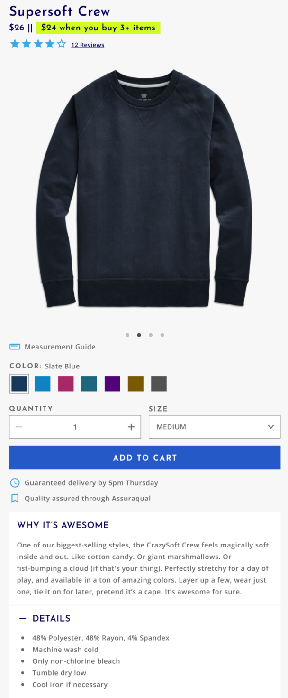

_If you'd rather watch than read, check out [In the file: Creating multi-brand design systems](https://www.youtube.com/watch?v=tuKjwceTvDM)._

Everyone wants to talk about multi-brand design systems lately. And no wonder! Companies like [Figma](www.figma.com) and [Framer X](www.framerx.com) are working hard to improve designer/developer collaboration. React, Angular, and Vue (which are all component-based) are the most popular frontend JavaScript frameworks right now. And Material Design––Google's design system––is 6 years old!

When I first started researching multi-brand design systems, there were hardly any resources to draw from. Lots of companies had component libraries, but they mostly supported monolithic brands like Google or Atlassian.

It really hit me how many companies are trying to solve this problem while I was participating in a [Figma panel](https://www.youtube.com/watch?v=tuKjwceTvDM) last Tuesday. I glanced down at the number of people in the audience; _505 people wanted to better understand how to build a design system that would work across multiple brands._ I was shocked!

I figured that the audience members would be looking for a solution to specific problems they were facing in their own jobs. But I don't think that there is a one-size-fits-all solution to the multi-brand design system problem. The solution that works for a specific company depends on a number of factors, including how flexible the brands need to be, how much money is available to invest in the design system, and how willing the team's peers are to adopt the system.

I realized I couldn't tell the audience what I thought they really wanted to hear. But I could share the core concept that we constantly return to as we think through how to structure our design system: **progressive disclosure of complexity**.

### Progressive Disclosure of Complexity

[Progressive disclosure](https://www.nngroup.com/articles/progressive-disclosure/) is a design term that describes when a designer “defers advanced or rarely used features to a secondary screen, making applications easier to learn and less error-prone\*.”

When a user first comes to your website, you don't want to show them every single setting they could possible toggle. That would be really complicated and confusing, and your user would probably leave feeling frustrated! Instead, you want to show them the most common functions they should be able to perform with your site. Then, as the user becomes more advanced, you should let them discover more advanced functionality and behaviors.

As I was reading Jason Lengstorf's [blog](lengstorf.com), I stumbled upon his post called ["Automation + Control: Progressive Disclosure of Complexity."](https://lengstorf.com/). Jason borrows the concept of progressive disclosure to design and applies it to engineering, coining the term progressive disclosure of complexity.

My main takeaway from his blog post is that you should allow your users to trade complexity for flexibility.

### Trading Complexity for Flexibility

Let's step back and think about what it means to trade complexity for flexibility for a moment.

When we think about building a design system, we want to provide our users with **sane defaults** that they can opt-out of when they need more advanced features. When users feel like they need more flexibility, they should be able to drop down into a lower level of abstraction instead of ejecting out of the system.

### Layers of Abstraction

On the Forge team at Harry's, we organize our system into four different layers of abstraction. All work takes place on a spectrum from **least complex / least flexible** to **most complex / most flexible**.

For this to make sense, I need to define some terms for you:

**Base components** are the smallest possible building block of a site. These are elements like buttons, links, and cards. They can be composed together to build higher levels of abstraction.

**Layout components** are built out of two or more base components.

In the example above, the layout component consists of two base components, a quantity selector and a button. We might call this component something like `AddToCard />`.

**Starter kits** are design files and cloneable sites that are composed of many layout components. A page in a starter kit might look like this:

#### Least Complex / Least Flexible 🚀

A team that was happy with the defaults set by the starter kit would opt into this layer if they did not want to spend a lot of time, effort, or money customizing a site further.

In this case, a designer would apply the brands colors, typography, and imagery to the Figma kit. Then, a developer would apply the design tokens to the codebase.

#### Less Complex / Less Flexible 🚢

Let’s say that a product manager realizes that users aren't adding as many items to the cart as they would like. They might decide to rearrange the layout components on the product display page to A/B test a new experience.

A designer would rearrange the layout components in Figma, and a developer would move the layout components from our component library to match.

#### More Complex / More Flexible 🚗

Now, the product manager notices that a lot of people are confused about how to use the product. They decide that it'd be useful to have a carousel on the PDP page to show the product being used in different ways. But we don't have a carousel in our design system yet!

The designer would use the existing button, slider, and card base components to create a carousel. Then, the developer would use the existing base components to build a carousel.

#### Most Complex / Most Flexible 🚴‍♀️

Ultimately, a product manager is allowed to rewrite the whole PDP from scratch if they feel that’s appropriate. But even if the whole PDP is custom, the team still doesn’t need to leave the system––they can still leverage the cart and checkout from the starter kit at the “least complex / least flexible” level while opting into the “most complex / most flexible” level on the PDP.

### Reach out to me

I hope this was a helpful explanation of progressive disclosure of complexity! Feel free to [reach out to me](https://twitter.com/MCapoz) on Twitter if you have any questions or suggestions about this post.

---

\* This definition comes from the [Norman Nielsen Group](https://www.nngroup.com/articles/progressive-disclosure/).
