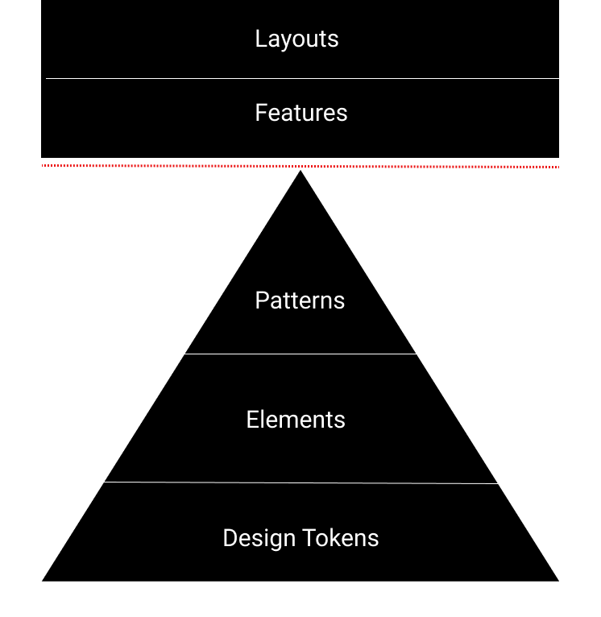

While scrolling through Twitter the other day, I came across this tweet: https://twitter.com/markboulton/status/1397544012224073736​

I’ve been asking myself this question for a few years now. The best way that I’ve found to handle customization in a multi-product design system is to build it in layers. When we build in layers, consumers can adjust each layer when customization or differentiation is needed.

If you’re unfamiliar with this idea, I’ve written about in depth [here](../../layers-of-abstraction-in-design-systems/).

Below, I've added a diagram to share the layers that I try to stick to when building design systems.

​

In this diagram, design tokens, elements, and patterns are all part of the design system, and features and layouts live in application code. The dotted red line denotes the separation.

Ideally, most of the customization should happen at the design tokens level. Once you have tokens in place, you should be able to apply infinite themes to a wide range of codebases. Since tokens control styling data like color, fonts, spacing, even if the elements and patterns used are identical, the site should look pretty different.

Next, we have our elements (stand-alone components like a radioButton). Our elements should be token-aware so that when our theme changes, the element’s style also automatically changes.

Finally, we introduce patterns, which are composed of 2 or more elements. A good example is a radioList. We can create infinite permutations of patterns by combining elements in multiple ways.

Brands should have the option to use the pattern as-is, or to create new patterns and introduce them to the design system.
