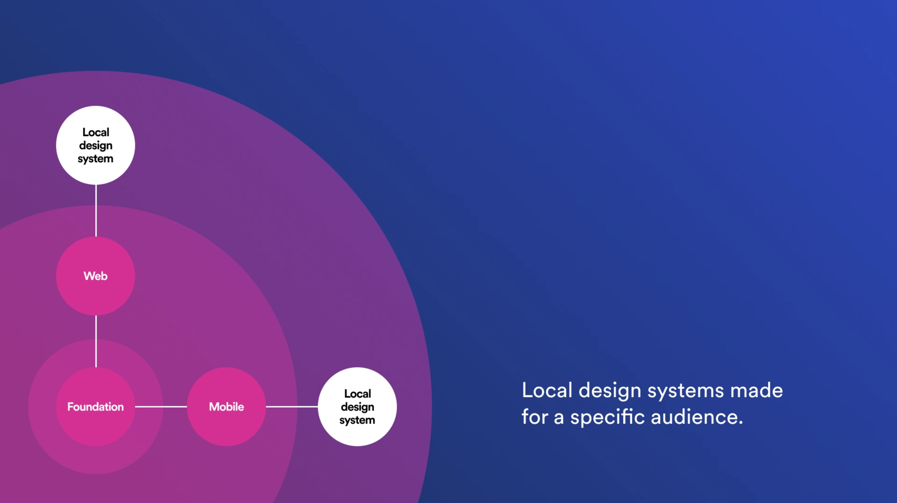

Happy Wednesday!

I know that looking for jobs can be frustrating and exhausting. Hours of scrolling through hundreds of postings on job boards, time spent moving bullet points around on your resume, and then a month(s)-long interview process. Especially if you're looking for a specific role in a niche like...hm, I don't know...design systems!

Unfortunately, I can't help you out with the 8-stage interviews you'll inevitably have to pass. But I can definitely help you get started!

**Last week, I added a new [Open Jobs](https://maecapozzi.com/open-jobs/) page to https://maecapozzi.com!**

Take a look and see if any of these open roles strike you as interesting. And as always, reach out if you need help.

And to those of you who are hiring -- I'll be sending the fourth _Jobs_ edition of this newsletter out tomorrow! Fill out this [form](https://forms.gle/tCRpGy7PMfQGqu5B9) and I'll share your open jobs with everone subscribed to the newsletter.

---

Whether or not you've heard the term "local design systems," I have an inkling you might want to pay attention to this trend.

I first read about the term in a blog post called [Reimagining Design Systems at Spotify](https://spotify.design/article/reimagining-design-systems-at-spotify). Spotify's design system Encore is architected somewhat like an onion -- it has a lot of layers!

At the core is **Encore Foundation** which contains the basic building blocks of the design system:

- color
- type styles
- motion
- spacing
- writing and accessibility guidelines
- design tokens.

All other projects need to include Encore Foundation, since it contains the data describing Spotify's brand identity.

From there, different platforms need different libraries. **Encore Web** contains components designed to be used with web technologies.

**Encore Mobile** is used with mobile tech. These components are generic and reusable by many different teams.

For a lot of companies, architecture this complex might be overkill.But when it comes to massive companies with later stage design systems, a new need has arisen.

Companies like Spotify have codebases that are "tailored for specific products or audiences", that need product-specific complex components built on top of Encore Web or Encore Mobile.

This is where the term _local design systems_ comes from: "Local systems are a place to keep design elements that are tailored for specific products or audiences."

_source: Reimagining Design Systems at Spotify_

I mistakenly thought that this terminology and approach was specific to Spotify, until I realized that Shopify is adopting this pattern as well.

If you'd like to read more about Shopify's adaptation of the local design system pattern, you can find the article [here](https://ux.shopify.com/building-a-local-design-system-b2810c6e01f2).

--

If you like this [newsletter](https://maecapozzi.com/newsletter/) it would really help me if you shared it with your friends. Tweet about it, post on LinkedIn, and share in slack channels. Building this community can lead all of us to more job opportunities, guest posts, and connections.

Talk soon,

Mae
​
