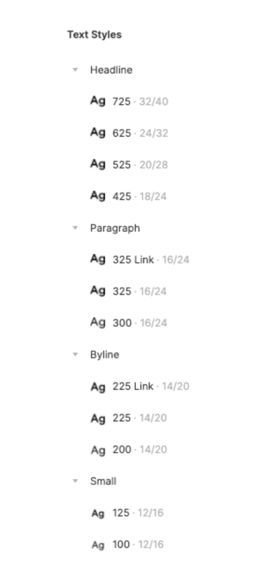
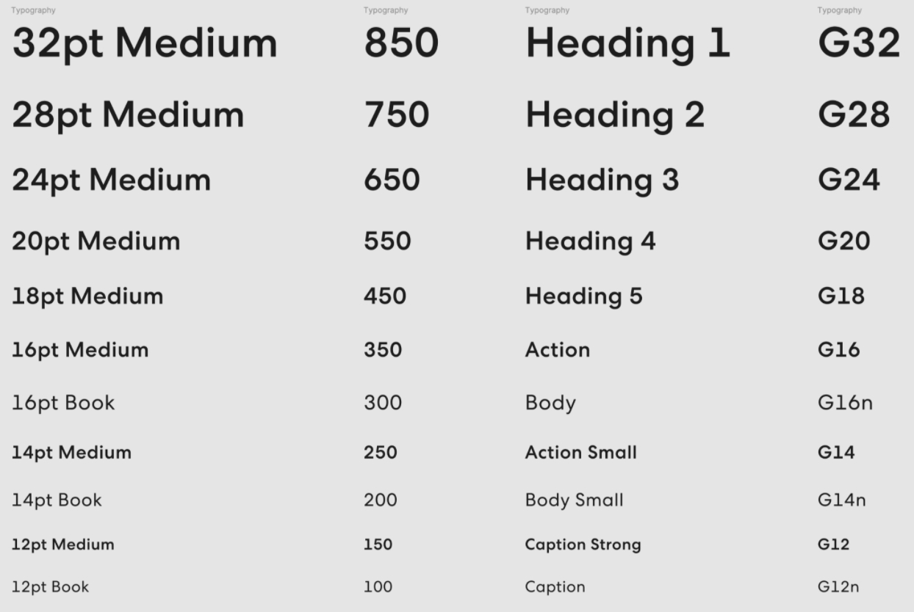

Happy Wednesday!

Today I'm sharing a guest post by [Derek Torsani](https://derektorsani.com/). Derek is a designer with 5+ years of experience in design systems. He is currently working as a systems designer at [Gusto](https://gusto.com/), building tools to help designers and engineers work better together.

---

by Derek Torsani

Naming is hard. Especially when it comes to naming design tokens.

“Design tokens are indivisible pieces of a design system such as colors, spacing, typography scale.” This is defined by the Design Tokens W3C Community Group, co-chaired by [@kaelig](https://twitter.com/kaelig), [@jina](https://twitter.com/jina), and [@vlh](https://twitter.com/vlh). You can read more about design tokens [here](https://github.com/design-tokens/community-group).

Let’s talk about naming typography tokens (text styles in design tools). Typically, when we think about type styles, we might think of H1, H2, etc. However, these are HTML tags. They give a webpage semantic hierarchy which helps with SEO and accessibility for keyboard and screen reader users. Although they might be displayed at different sizes by default, these heading tags should not be used to represent size or style.

Imagine you name your text styles H1 for the largest, H2 for the second largest, and so on. You may insert an H1 to establish your main heading for the page or section, but then you want to use a smaller size for a subheading, so you use your H3 style. Semantically this is incorrect and will cause accessibility issues. Naming your tokens in this way causes limitations and confusion when ensuring parity between how designers and engineers use typography.

Instead, it is more helpful to let H1, H2, etc. be the HTML tags in which to insert text, and use class names to determine the style of that text. These class names can be the tokens that are named cohesively between design and engineering.

At Gusto, we use the hundredths numeric scale — 100, 200, 300, etc. starting from smallest to largest for size. We also incorporate a weight scale into the tenths and hundredths place, such as 100 for normal weight, 125 for medium weight, 150 for semi-bold, and 175 for bold. This token nomenclature builds in both size and weight into one scale.

Although we only have two weights for our typeface, we still use the weight scale, which helps us plan for later if we decide to add more weights. For those type sizes that we only want the bolder weight to be used, we omit the -00 value for that type token. As much as we can encourage usage through what is available to designers and engineers, we do so.

Other token naming ideas we decided not to use were; size and weight — 12pt Medium, 16pt Book, etc., use case — Heading 1, Action, Body, etc., and font name and size of the type — Sans12, Serif16, etc.,

Reply to this email if you’re open to sharing how you name type tokens in your design system!

To read more about why headings aren’t style elements, [check out this article](https://www.boia.org/blog/why-headings-arent-simply-style-elements) by the Bureau of Internet Accessibility.

---

If you like this [newsletter](https://maecapozzi.com/newsletter/) it would really help me if you shared it with your friends. Tweet about it, post on LinkedIn, and share in slack channels. Building this community can lead all of us to more job opportunities, guest posts, and connections.

Talk soon,

Mae
